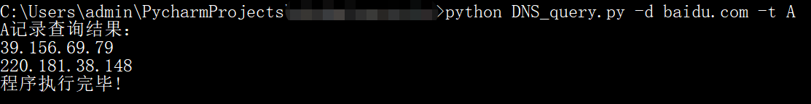

# DNS_query

一个查询DNS记录的小工具。

### 查看帮助文档

`python DNS_query.py -h`

```
usage: dns.py -d baidu.com -t A

DNS Tools V1.0

optional arguments:
  -h, --help            show this help message and exit
  -t TYPE, --type TYPE  DNS记录类型
  -d DOMAIN, --domain DOMAIN
                        要查询的域名
  -a, --all             获取指定域名的所有DNS类型记录 包括A,CNAME,MX,AAAA,TXT,NS,SRV,CAA记录
  -f FILE, --file FILE  导入文件批量查询指定DNS记录
```


### 基本功能

#### 查询单个域名的指定记录

如查询百度域名的A记录，输入以下命令：`python DNS_query.py -d baidu.com -t A`。




#### 查询单个域名的常用记录

如查询百度域名的所有DNS类型记录，包括A,CNAME,MX,AAAA,TXT,NS,SRV,CAA记录，输入以下命令：`python DNS_query.py -d baidu.com -a`。


### 

#### 目标域名从文件导入

`pythonD NS_query.py -f domain.txt -a`

